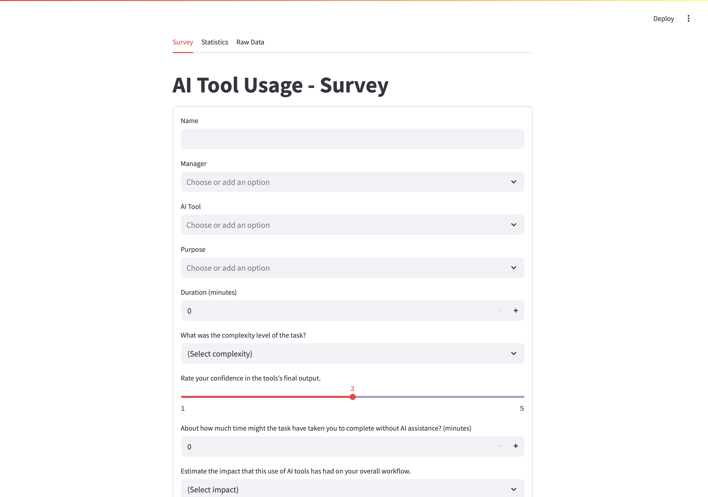
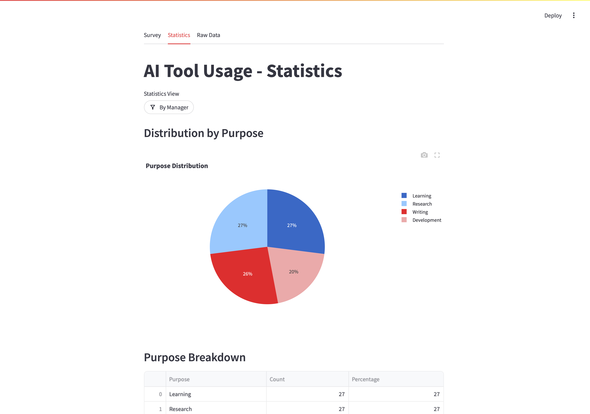
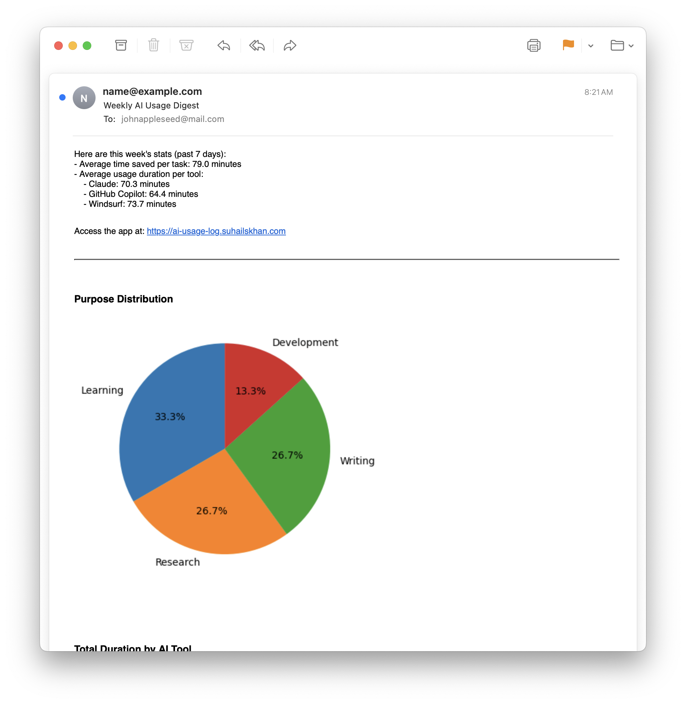

# AI Usage Log

A Streamlit-based application for tracking and analyzing AI tool usage within an organization. This application allows employees to log their AI tool usage, including time spent, purpose, and outcomes, and provides visualization features for analyzing the data.

## Features

- **Data Entry:** Log AI tool usage with details such as employee name, manager, tool used, purpose, duration, and outcomes
- **Analytics Dashboard:** Visualize usage patterns through charts and tables
- **Flexible Storage Options:** Store data in CSV or SQLite database
- **Environment Configuration:** Easily configure storage options via the `.env` file
- **Weekly Digest Email:** Automatically sends a weekly email summarizing key usage statistics, including charts and insights, to configured recipients.

## Analytics

The application provides the following analytics features:

- **Purpose Distribution:** Visualize the distribution of AI tool usage purposes using pie charts.
- **Duration Analysis:** Analyze the total and average duration of tasks by AI tool.
- **Time Saved Analysis:** Compare the time taken with and without AI assistance, including total and average time saved.
- **Tool Effectiveness Benchmarking:** Evaluate AI tools based on average time saved, satisfaction, and workflow impact.
- **Complexity vs Impact:** Understand the relationship between task complexity and workflow impact.
- **Satisfaction vs Efficiency:** Explore the correlation between user satisfaction and time saved.
- **Manager/Team Insights:** Gain insights into team performance, including average time saved and satisfaction by manager.
- **Purpose-based Use Cases:** Analyze average time saved, satisfaction, and workflow impact for different purposes.
- **Trend & Seasonality Analysis:** Identify trends in AI tool usage over time, including daily and weekly patterns.

## Usage

### Running the Application

1. Clone this repository:
   ```bash
   git clone https://github.com/suhailskhan/ai-usage-log
   cd ai-usage-log
   ```

2. Create virtual environment and install dependencies:
   ```bash
   python -m venv venv
   venv/bin/activate
   pip install -r requirements.txt
   ```

3. Start the Streamlit application:
   ```bash
   streamlit run app.py
   ```
By default, the application will use SQLite storage. See [Storage Configuration](#storage-configuration) for more details.

### Storage Configuration

The application supports three storage types:

1. **CSV Storage:** Simple file-based storage
2. **SQLite Storage (Default):** Local database file storage

Configure storage via the `.env` file:

```env
# For SQLite (default)
STORAGE_TYPE=SQLite

# For CSV
STORAGE_TYPE=CSV
```

If `STORAGE_TYPE` is not set, the application defaults to SQLite.

## Configuration via .env

The following settings can be configured in your `.env` file:

| Variable         | Description                                                      | Example Value(s)                        |
|------------------|------------------------------------------------------------------|------------------------------------------|
| MANAGER_CHOICES  | Comma-separated list of manager names for the survey             | Alice,Bob,Charlie                        |
| TOOL_CHOICES     | Comma-separated list of AI tools                                 | ChatGPT,GitHub Copilot,Claude            |
| PURPOSE_CHOICES  | Comma-separated list of purposes                                 | Development,Writing,Research,Other       |
| STORAGE_TYPE     | Storage backend: `SQLite` (default) or `CSV`                     | SQLite                                   |
| SMTP_SERVER      | SMTP server for weekly digest email                              | smtp.example.com                         |
| SMTP_PORT        | SMTP server port (usually 465 for SSL)                           | 465                                      |
| SMTP_USERNAME    | SMTP login username                                              | your_email@example.com                   |
| SMTP_PASSWORD    | SMTP login password or app password                              | your_password                            |
| RECIPIENTS       | Comma-separated list of email recipients for the digest          | recipient1@example.com,recipient2@ex.com |
| STREAMLIT_APP_URL| Public or local URL for the Streamlit app (for email links)      | http://localhost:8501                    |

See [`.env.example`](.env.example) for a template. All fields are optional except SMTP settings if you want to enable weekly email digests.

## Application Structure

- `app.py`: Main Streamlit application with UI and visualization logic
- `storage.py`: Data storage abstraction with support for multiple backends
- `requirements.txt`: Python dependencies

## Screenshots

### Survey



### All Statistics



### Statistics by Manager


### Purpose Breakdown & Duration by AI Tool


### Time Saved Analysis


### Tool Effectiveness Benchmarking & Complexity vs Impact


### Satisfaction vs Efficiency


### Purpose vs AI Tool: Avg Time Saved Heatmap


### Trend & Seasonality Analysis


### Weekly Average Time Saved


### Raw Data


### Digest Email



